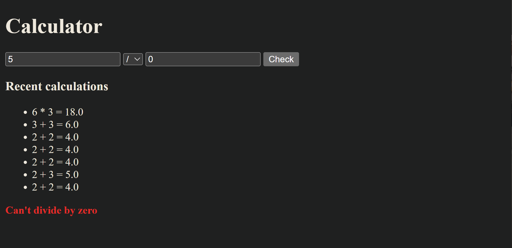
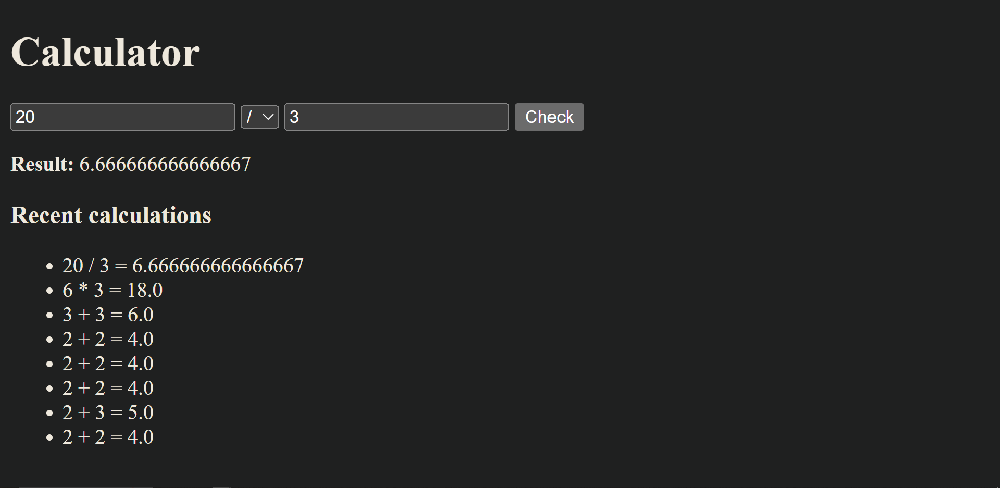

# Simple Calc (Flask + SQLAlchemy)

A simple web calculator built with Flask. It supports basic operations (+, -, *, /), validates inputs (including divide-by-zero), and saves the last calculations to a SQLite database using SQLAlchemy.

## Features
- Calculator operations: `+  -  *  /`
- Form handling with GET/POST
- Input validation + friendly error messages
- Stores calculation history in **SQLite** via **SQLAlchemy**
- Displays the 10 most recent calculations

### How to open
Install
  - pip install virtualenv
  - pip install flask flask_sqlalchemy

Run Simple_Calc.py

Go to http://127.0.0.1:5000

## Demo

